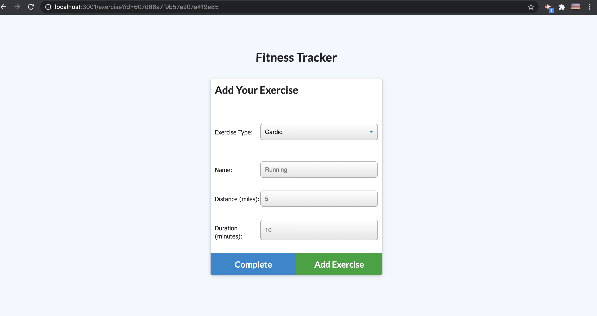

# workout_Tracker

## Description 
- This project- the workout_Tracker was created using Mongo database with a Mongoose schema and handle route with Express.
- The application should be able to let the user create, view and track his/her daily activities.
- The user should enbale to track the name, type of exercise, weight, sets, reps and duration od exercise, if the exercise is cardio the user should also able to track the distance that he/she travelled.

 ---
# Table of Contents 

  - [Description](#Description)
  - [Technologies](#Technologies)
  - [Links](#Links)
  - [Screenshots](#Screenshots)
  - [License](#License)
  - [Questions](#questions)
---

## Technologies
node js, npm, mongodb, mongoose , heroku

---
## Links
 - Github: (https://github.com/joannejavillo/workout_Tracker)
 - Heroku: (https://morning-escarpment-60880.herokuapp.com/)
 
---
## Screenshots

---
## License
- MIT
---
## Questions
If you have any questions you can contact me at jo_anne.javillo@outlook.com or you can visit my gitHub page: (https://github.com/joannejavillo)